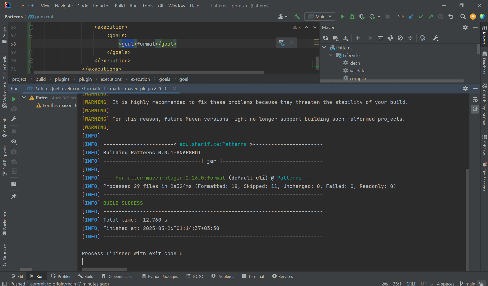

# Refactoring

# پاسخ به سوالات

## سوال ۱
- کد تمیز: کدی که قابل فهم و ساختار یافته باشد و نگهداری آن هم آسان باشد.

- بدهی فنی: اگر در حین توسعه‌ی نرم‌افزار برای انجام کاری یا حل مشکلی از راه حلی که لزوما بهترین راه حل نیست (و معمولا راه حل آسانی است) استفاده کنیم، باعث می‌شود که در آینده نیاز باشد که کد را refactor کنیم و یا مشکلات دیگری پیش بیایند و در هر حال هزینه‌ی اضافه‌ای متحمل شویم. به این هزینه بدهی فنی می‌گویند.

- بوی بد: نشانه‌ای در کد است که نشان می‌دهد یک مشکل عمیق‌تر در دیزاین کد یا ساختار کد وجود دارد و ممکن است منجر به بروز مشکلاتی در نگهداری و توسعه شود.

## سوال ۲
بوهای بد کد به پنج دسته اصلی تقسیم می شوند:

- Bloaters: این بوها شامل قطعات کدی هستند که بسیار بزرگ شده اند و درک و مدیریت آنها سخت است. مثال: شامل کلاس‌های بزرگ، متودهای طولانی

- Object-Oriented Abusers: این بوها نشان دهنده‌ی استفاده‌ی نادرست از اصول شیءگرایی هستند. مثال: سوئیچ‌های شرطی طولانی

- Change Preventers: کدهایی هستند که به گونه‌ای نوشته شده‌اند که تغییر دادن را دشوار می‌کنند به طوری که یک تغییر در یک قسمت از کد ممکن است نیاز به تغییرات زیادی در قسمت های دیگر داشته باشد.

- Dispensables:  شامل کدی هستند که دیگر مورد نیاز نیستند و فقط باعث شلوغی کد می‌شوند.

- Couplers: نشان دهنده‌ی وابستگی بیش از حد بین کلاس‌ها هستند که تغییر یکی از کلاس‌ها را سخت می‌کند.

## سوال ۳
- در دسته‌بندی Couplers قرار می‌گیرد.
- برای برطرف کردن این بو، استفاده از بازآرایی‌های Move Method،  Extract Class و Move Field پیشنهاد می‌شود.
- در مواقعی باید این بو را نادیده گرفت که وابستگی به یک کلاس دیگر به دلیل یک منطق واضح و متمرکز باشد و انتقال کد باعث پیچیدگی غیرضروری شود.

## سوال ۴

- بوهای بد کد معمولاً تاثیر فوری بر عملکرد صحیح برنامه ندارند. برنامه ممکن است با وجود داشتن بوهای بد به درستی کار کند. اما باگ‌ها به طور مستقیم بر عملکرد برنامه تاثیر می‌گذارند و باعث بروز رفتارهای ناخواسته می شوند.

- برخورد با بوهای بد کد از طریق Refactoring صورت می گیرد، که هدف آن بهبود ساختار و طراحی کد بدون تغییر رفتار خارجی آن است. در مقابل، برخورد با باگ‌ها شامل شناسایی علت ریشه‌ای خطا به کمک روش‌های دیباگ و سپس رفع آن با تغییر منطق کد به منظور تولید رفتار صحیح است

## سوال ۵

1. Long Method: در فایل‌های زیادی از پروژه از متودهای طولانی استفاده شده است. مثلا در LexicalAnalyzer متود getTokensOfPhase2Files بسیار طولانی است.
2. Switch Statements: در همین متودی که در مورد ۱ به آن اشاره شد، سوییچ طولانی وجود دارد.
3. Primitive Obsession: از String بسیار زیاد برای نمایش انواع مقدارها و توکن‌ها استفاده شده است.
4. Large Class: مثلا کلاس Phase2CodeFileManipulator بسیار بزرگ است و فیلدهای خیلی زیادی دارد.
5. Data Clumps: کلاس Phase2CodeFileManipulator این مشکل را هم دارد. چندین گروه از فیلدهای مرتبط به نظر می‌رسد با هم مدیریت می‌شوند. برای مثال، firstClassCalled، lastClassCalled و numberOfClassCalled فراخوانی‌های کلاس را پیگیری می‌کنند.
6. Comments: در سرتاسر کد می‌توان کامنت‌های زیادی پیدا کرد که توضیحات اضافی یا غیرضروری ارائه می‌دهند.
7. Middle Man: در کلاس Phase2CodeFileManipulator برخی از متدهای خصوصی، به ویژه آنهایی که در مدیریت pairVector و وضعیت نقش دارند (مانند تنظیم‌کننده‌ها یا دریافت‌کننده‌های ساده، یا متدهایی که فقط متدهای دیگر را بدون افزودن منطق قابل توجهی فراخوانی می‌کنند)، ممکن است به عنوان Middle Men عمل کنند
8. Shotgun Surgery: این مورد هم به دلیل پیچیدگی زیاد کدها و وابستگی زیاد بین متودها وجود دارد. مثلا در کلاس LexicalAnalyzer تغییر در نحوه تشخیص یا پردازش توکن‌ها نیاز به تغییرات کوچک در چندین متد استاتیک این اینترفیس دارد.
9. Magic Strings: در پروژه از رشته‌های ثابت زیادی استفاده شده است که به صورت مستقیم در کد نوشته شده‌اند و بدون توضیح یا تعریف قبلی استفاده می‌شوند. این می‌تواند باعث سردرگمی شود و در صورت نیاز به تغییر این رشته‌ها، نیاز به تغییر در چندین مکان باشد. مثلا CHOOOSE
10. Speculative Generality: در کلاس LexicalAnalyzer  متد getWithoutArrayBracket به نظر می‌رسد به طور خاص برای مدیریت براکت‌های آرایه با اندیس‌های عددی طراحی شده است و ممکن است در صورت استفاده محدود، این مشکل را داشته باشد.

## سوال ۶
پلاگین formatter به طور خودکار کد را بر اساس مجموعه ای از قوانین از پیش تعریف شده یا قابل تنظیم، قالب بندی می کند. 
این شامل مواردی مانند تنظیم تورفتگی ها، فاصله گذاری ها، نحوه قرارگیری آکولادها، و طول خطوط کد می شود.
این کار باعث می شود که کد خواناتر و قابل فهم تر باشد و همچنین به حفظ یک سبک کدنویسی یکنواخت در پروژه کمک می کند.
 قبل یا بعد از انجام تغییرات در کد و یا بازآرایی، استفاده از formatter می تواند اطمینان حاصل کند که کد جدید یا تغییر یافته با سبک کدنویسی پروژه سازگار است و خوانا است.
این امر به حفظ کیفیت کلی کد پس از بازآرایی کمک می کند

# MiniJava

در این بخش درباره‌ی بازآرایی‌های انجام شده توضیح می‌دهیم.

1. Facade 1: مشاهده می‌کنیم که کلاس CodeGenerator در parser استفاده شده است ولی از همه‌ی متودهایش استفاده نشده است. بنابراین خوب است که codeGeneratorFacade را طراحی کنیم و متودهای semanticFunction و printMemory را اضافه کنیم.

2. Facade 2: مورد بعدی کلاس Memory است. این کلاس در کلاس‌های SymbolTable , CodeGenerator استفاده شده است. به همین علت مشابه مورد قبلی MemoryFacade را می‌سازیم.

3. Separate query From Modifier: این مورد در جاهای متعددی مشاهده می‌شود که ما یک نمونه را تغییر داده‌ایم. در کلاس Memory یک تابع getTemp وجود دارد که باید آدرس خانه‌ی بعدی حافظه temp را بدهد. این متود هم آدرس را آپدیت می‌کند و هم آدرس خروجی را برمی‌گرداند. برای اعمال بازآرایی این متود را به دو متود getNewTemp , updateLastTempIndex شکانده ایم. هر جا هم که متود getTemp صدا زده شده بود هر دو را صدا زده ایم.

4. Self Encapsulated Field: در همان کلاس Memory می‌توان دید که پارامترهای lastDataAddress  و lastTempIndex درون خود کلاس به صورت مستقیم استفاده شده‌اند. به کلاس getter , setter این متودها را اضافه کردیم و هر جا مقدار مستقیم را کار داشتیم یکی از این دو متود را کال می‌کنیم.

5. Replace Conditional with Polymorphism: همان طور که در کد دیده می شود درمتود start parse در parser یک getActionTable داریم که هرسری از آن یک action گرفته می شود و بسته به action.act تصمیم گرفته می‌شود که چه کاری (shift, reduce, accept) انجام شود. ما برای بازآرایی، یک کلاس ابسترکت به نام action ساختیم و اکشن‌های shift, reduce آن را extend می‌کنند. به این ترتیب به جای استفاده از switch case کافیست از currentAction.performAction استفاده کنیم (به همراه یک سری تغییرات دیگر)

6. Extract Method: یکی از بازآرایی‌هایی که انتخاب کردیم انجام دهیم extract method است. متودهای طولانی متعددی در این پروژه وجود دارند. ما متود startParse در Parser را انتخاب کرده‌ایم. این متود یک حلقه‌ی while دارد که می‌توان منطق داخل آن را جدا از متود اصلی دید. بنابراین یک متود doNextAction تعریف کرده‌ایم که هر بار action را از actionTable می‌گیرد و performAction را اجرا می‌کند و لاگ‌های لازم را می‌اندازد.

7. Replace Constructor with Factory Method: می‌توان مشاهده کرد کا کانستراکتور کلاس ParseTable بسیار طولانی و پیچیده است. ما یک کانستراکتور ساده برای ان می‌گذاریم و سپس یک متود استاتیک createConstructor تعریف می‌کنیم (که خودش نیز درون خودش از چند متود استاتیک دیگر استفاده می کند)

# Formatter

پس از اعمال بازآرایی‌ها، پلاگین formatter را به maven اضافه می‌کنیم. سپس آن را از طریق maven اجرا می‌کنیم. گزارش اجرا به این صورت است:

مشاهده می‌شود که تغییرات بسیاری هم در کد اعمال شده است. این تغییرات شامل تنظیم تورفتگی‌ها، فاصله‌گذاری‌ها، و نحوه قرارگیری آکولادها است. این کار باعث می‌شود که کد خواناتر و قابل فهم‌تر باشد و همچنین به حفظ یک سبک کدنویسی یکنواخت در پروژه کمک می‌کند.
